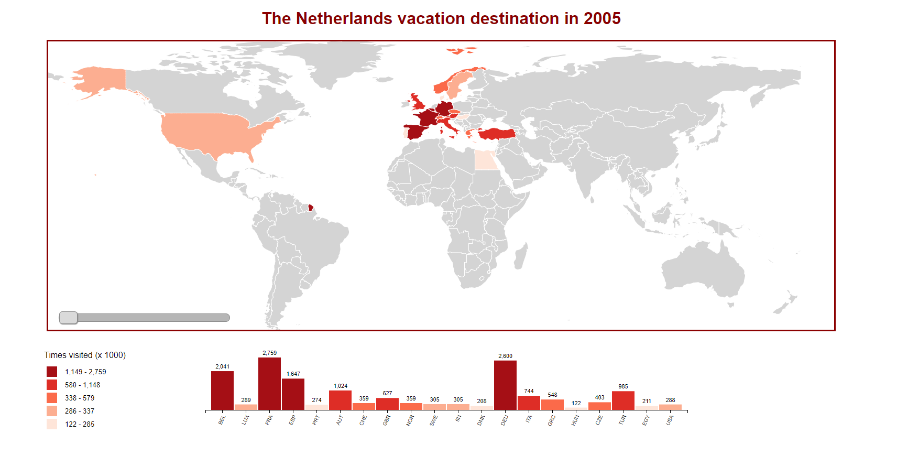

# The Netherlands vacation destination in ...
In this visualization you see one main world-map chart and one bar chart. These two charts are linked to each other by the amount of vacations destinations per country.
This visualization was based on the code from [d3.js slider map](http://bl.ocks.org/tomschulze/961d57bd1bbd2a9ef993f2e8645cb8d2) by Tom Schulze (GNU v.3).

In this chart you can navigate through the year 2005 and 2016. This makes the changes in the years visible to the user. The user can also hover on the label color. This will make the remainder colors disappear and only the countries who are in the hovered range will be visible in the graph.
In the bar chart you can read what the exact number of times is that people of The Netherlands went to one country.



## Data
The data that I used for my graph is from the [CBS](http://statline.cbs.nl/Statweb/publication/?DM=SLNL&PA=70232NED&D1=1,3-4,6,8,10,12,14,16,18,20,22,24,26,28,30,32,34,36,38,62,64,66,68,70,72-74,76,78,80,82,84,86,88,90,92,94,96,98,100,102,104,106,108,110,112,114,116,142,144,146,148,150,152-153&D2=15-26&HDR=T&STB=G1&VW=T). The data that I used has the following:
* Data from the year 2005 until 2016.
* Average time that people go on vacation per year.
* Where people go on vacation. (In the Netherlands and outside Netherlands)
* How people go on vacation, so the differs kind of transport they use.
* How many people spent on their vacations.

The original data was "dirty data" in a `.csv` file. The file has:
* An introduction text.
* The columns and row labels.
* The data itself
  - Separated by semicolons.
* A footer

For the world map chart I used the following data:
* Vacations outside The Netherlands
  - Country names
* How many vacations in one country
  - Number (x1000)

* [`index.csv`]() - [Centraal Bureau voor de Statistiek](https://www.cbs.nl/nl-nl)

```
"Vakanties; kerncijfers"
"Onderwerpen";"Deelnemers aan vakanties";"Totaal aantal vakanties";"Vakanties in Nederland";"Vakanties in Nederland";"Vakanties in Nederland";"Vakanties in Nederland";"Vakanties in Nederland";"Vakanties in Nederland";"Vakanties in Nederland";"Vakanties in Nederland";"Vakanties in Nederland";"Vakanties in Nederland";"Vakanties in Nederland";"Vakanties in Nederland";"Vakanties in Nederland";"Vakanties in Nederland";"Vakanties in Nederland";"Vakanties in Nederland";"Vakanties in Nederland";"Vakanties in Nederland";"Vakanties in Nederland";"Vakanties in Nederland";"Vakanties in Nederland";"Vakanties in Nederland";"Vakanties in Nederland";"Vakanties in Nederland";"Vakanties in Nederland";"Vakanties in het buitenland";"Vakanties in het buitenland";"Vakanties in het buitenland";"Vakanties in het buitenland";"Vakanties in het buitenland";"Vakanties in het buitenland";"Vakanties in het buitenland";"Vakanties in het buitenland";"Vakanties in het buitenland";"Vakanties in het buitenland";"Vakanties in het buitenland";"Vakanties in het buitenland";"Vakanties in het buitenland";
...
"Belgi�";"Luxemburg";"Frankrijk";"Spanje";"Portugal";"Oostenrijk";"Zwitserland";"Groot-Brittanni�";"Noorwegen, Zweden, Finland";"Denemarken";"Duitsland";"Itali�";"Griekenland";"Hongarije";"Tsjechi�";"Turkije";"Egypte";"Verre Oosten";"Verenigde Staten";"Caribisch gebied";"Overige landen";"Auto";"Trein";"Touringcar";"Vliegtuig";"Overige vervoermiddelen";"Totale uitgaven voor vakanties";"Gemiddelde uitgaven per vakantieganger"
"Perioden";"x 1000";"x 1000";"x 1000";"x 1000";"x 1000";"x 1000";"x 1000";"x 1000";"x 1000";"x 1000";"x 1000";"x 1000";"x 1000";"x 1000";"x 1000";"x 1000";"x 1000";"x 1000";"x 1000";"x 1000";"x 1000";"x 1000";"x 1000";"x 1000";"x 1000";"x mld. euro";"euro`s";"x 1000";"x 1000";"x 1000";"x 1000";"x 1000";"x 1000";"x 1000";"x 1000";"x 1000";"x 1000";"x 1000";"x 1000";"x 1000";"x 1000";"x 1000";"x 1000";"x 1000";"x 1000";"x 1000";"x 1000";"x 1000";"x 1000";"x 1000";"x 1000";"x 1000";"x 1000";"x 1000";"x mld. euro";"euro`s"
"2005";"12436";"34400";"17314";"1058";"2070";"684";"751";"561";"117";"477";"1991";"133";"647";"1412";
```

## Features

### D3
* [`d3.geoPath`](https://github.com/d3/d3-geo/blob/master/README.md#geoPath) - Creates a new geographic path generator with the default settings.
* [`d3.scaleBand`](https://github.com/d3/d3-scale/blob/master/README.md#scaleBand) - Constructs a new band scale with the empty domain, the unit range [0, 1], no padding, no rounding and center alignment.
* [`d3.scaleLinear`](https://github.com/d3/d3-scale/blob/master/README.md#scaleLinear) - Constructs a new continuous scale with the unit domain [0, 1] and the unit range [0, 1]
* [`d3.scaleQuantile`](https://github.com/d3/d3-scale/blob/master/README.md#scaleQuantile) - Quantile scales map a sampled input domain to a discrete range. Constructs a new quantile scale with an empty domain and an empty range. The quantile scale is invalid until both a domain and range are specified.
* [`topojson`](https://github.com/topojson/topojson/wiki) - TopoJSON is an extension of GeoJSON that encodes topology.
* [`d3.event`](https://github.com/d3/d3-selection/blob/master/README.md#event) - This is set during the invocation of an event listener, and is reset after the listener terminates.
* [`selection.transition`](https://github.com/d3/d3-transition/blob/master/README.md#selection_transition) - Returns a new transition on the given selection with the specified name.
* [`d3.mouse .on(click)`](https://github.com/d3/d3-selection/blob/master/README.md#mouse) - Returns the x and y coordinates of the current event relative to the specified container.
* [`d3.zoom`](https://github.com/d3/d3-zoom/blob/master/README.md#zoom) - Creates a new zoom behavior.
* [`zoom.scaleExtent`](https://github.com/d3/d3-zoom/blob/master/README.md#zoom_scaleExtent) - The scale extent restricts zooming in and out.
* [`zoomIdentity`](https://github.com/d3/d3-zoom/blob/master/README.md#zoom_transform) -
* [` d3.quantile`]() - Returns the p-quantile of the given sorted array of numbers, where p is a number in the range [0,1].
* [`selection.node`](https://github.com/d3/d3-selection/blob/master/README.md#selection_node) - Returns the first (non-null) element in this selection. If the selection is empty, returns null.
* [`selection.call`](https://github.com/d3/d3-selection/blob/master/README.md#selection_call) - Invokes the specified function exactly once, passing in this selection along with any optional arguments.
* [`d3.map`](https://github.com/d3/d3-collection/blob/master/README.md#map) - Constructs a new map. If object is specified, copies all enumerable properties from the specified object into this map. The specified object may also be an array or another map.
* [`array.push`](https://developer.mozilla.org/en-US/docs/Web/JavaScript/Reference/Global_Objects/Array/push) - Add one or more elements to the end of the array.
* [`selection/enter`](https://github.com/d3/d3-selection/blob/master/README.md#selection_enter) - Returns the enter selection: placeholder nodes for each datum that had no corresponding DOM element in the selection. (The enter selection is empty for selections not returned by selection.data.)
* [`selection.update`](https://github.com/d3/d3-selection/blob/master/README.md#selection_data) - Joins the specified array of data with the selected elements, returning a new selection that represents the update selection: the elements successfully bound to data.
* [`selection.exit`](https://github.com/d3/d3-selection/blob/master/README.md#selection_exit) - Returns the exit selection: existing DOM elements in the selection for which no new datum was found. (The exit selection is empty for selections not returned by selection.data.)
* [`selection.remove`](https://github.com/d3/d3-selection/blob/master/README.md#selection_remove) - Removes the selected elements from the document.

* [`Color Category Scales`](https://github.com/d3/d3-scale#schemeCategory20c) - This color scale includes color specifications and designs developed by Cynthia Brewer (colorbrewer2.org).

## Workflow

1. Before I could start on this assessment I had to find a good data set that I could use to make multiple interactive visualizations.
    - The data that I would like to use for this assessment was "[Vakanties; kerncijfers](http://statline.cbs.nl/Statweb/publication/?DM=SLNL&PA=70232NED&D1=74%2c76%2c78%2c80%2c82%2c84%2c86%2c88%2c90%2c92%2c94%2c96%2c98%2c100%2c102%2c104%2c106%2c108%2c110%2c112%2c114%2c116&D2=15-26&HDR=T&STB=G1&VW=T)".
    This data was about where people from The Netherlands go on vacation inside and outside the country and the data provided was from 2006 until 2016.
    - From my instructor I got the feedback that this data was already a summary and it could be hard to provide several charts from it.
    - I understood his feedback but I still wanted to use this vacation data, so I [expanded the data](http://statline.cbs.nl/Statweb/publication/?DM=SLNL&PA=70232NED&D1=1,3-4,6,8,10,12,14,16,18,20,22,24,26,28,30,32,34,36,38,62,64,66,68,70,72-74,76,78,80,82,84,86,88,90,92,94,96,98,100,102,104,106,108,110,112,114,116,142,144,146,148,150,152-153&D2=15-26&HDR=T&STB=G1&VW=T) to have more possibilities with it.
    - I added the following to:
        * Average time that people go on vacation per year.
        * Where people go on vacation. (In the Netherlands and outside Netherlands)
        * How people go on vacation, so the differs kind of transport they use.
        * How many people spent on their vacations.
2. After I was clear about the data the data set I examined the data and tried to group data that I could use to compare to each other.
    - Total vacations token in The Netherlands - Total vacations outside The Netherlands.
    - The vacations cost.
    - Compare between the data from 2005 and 2016.
3. By grouping the data I got a lot of inspiration about different charts that I could use to display it. In the class I drew I couple of these ideas.
    - Bar charts
    - Pie charts
    - World/The Netherlands map
    - Chord
4. With the time my idea began to shape and my goal was:
    - Make an interactive pie chart where it shows how many people took vacation inside and outside The Netherlands.
    - When the user clicks in one of the two sides he gets a map. If you click on vacation outside the Netherlands you go to a map of the world and there it will show where the Netherlands people travel to. And when you choose inside the Netherlands you get a map of The Netherlands.
    - try to make a connection between the two maps so that you can switch between them.
    - If possible also show how much money it was spent on that year.
5. In this stage I wanted to clean my data. I started cleanen the data for my pie chart. When I `console.log` it the data seemed clean enough to use it. So I decided to also try to clean a second data for the map. See below for the code that I used.
    <details>
            <summary> Data cleanen code </summary>
            ```
            /*---------------------------------
            Data cleanen
            ----------------------------------*/

            var doc = d3.text(`index.csv`)
            .mimeType(`text/plain;charset=iso88591`) // Removed the strange signs from the data.
            .get(onload);

            function onload(err, doc) {
            if (err) throw err;

            doc = doc.replace(/"/g, ``) // Remove doube quotes (stackoverflow)
            doc = doc.replace(/;/g, `, `) // Remove semicolon

            var header = doc.indexOf(`2005`);
            var footer = doc.indexOf(`© Centraal`);

            doc = doc.slice(header, footer); //Removes the header and footer

            // First data set
            var vacation = d3.csvParseRows(doc, vacationNum)
            function vacationNum(d) {
            return {
            year: d[0],
            totaalNed: Number(d[3]),
            totaalBuiten: Number(d[28])
            }
            }

            //Second data set
            var dataCountries = d3.csvParseRows(doc, countries)
            function countries(d) {
            // Vakanties buiten Nederland
            return {
            year: d[0],
            Country: [
            "België", "Luxemburg", "Frankrijk", "Spanje", "Portugal","Oostenrijk", "Zwitserland"
            ],
            Code: ["BEL", "LUX", "FRA", "ESP", "PRT", "AUT", "CHE"],
            vacationNum: [
            Number(d[29]),
            Number(d[30]),
            Number(d[31]),
            Number(d[32]),
            Number(d[33]),
            Number(d[34]),
            Number(d[35]),
            ]
            }
            }

            console.log(vacationdoc)
            console.log(dataCountries)
            ```
    </details>

With this code I got the following on my console.log:

6. After a whole day cleaning my data I thought I was ready to load it to a chart. So I used the examples on internet to create the pie chart.
    - [This](http://www.ollie-odonnell.com/piecharttime) was the result that I would like to get.
    - I first tried to load the data on a simple pie chart but I wasn`t successful. I did get so far that my pie chart showed me the data I had cleaned. But it was not what I had in mind.
    
    - I wanted the pie chart only to show the data of one year and compare the value from `totaalNed` with `totaalBuiten`.

7. After a lot of trying I decided to go on with the world map. I hadn`t much time left and still wanted to make the world map. I was really excited to work with the `topoJson` because I think that to know how to create a map like this will be very handful to use in other lessons.

8. First I spent time reading about the `topoJson` to understand a little more about what it is and what I can accomplish with it.

9. At the same time I was also looking for example codes that I could use as a basis. First I took a look on the [work](https://github.com/levizimmerman/fe3-assessment-1) of [levizimmerman](https://github.com/levizimmerman) of assessment 1. He had made the same concept that I was trying to accomplish, so I took a look into his code to see what I could use.
    - At first I was a little disappointed because his code seemed more complicated than I thought. So I only tried to understand what he did and see which links he used.
    - I went back to a [simple world map](http://bl.ocks.org/almccon/fe445f1d6b177fd0946800a48aa59c71) and tried to make that to understand how map is written.
    - I also took a look to a [difficult ones](http://bl.ocks.org/micahstubbs/8e15870eb432a21f0bc4d3d527b2d14f.

10. After looking for a lot of examples and talks with my duck I finally fount one example that seemed pretty much like the concept that I had in mind for my data. So I copied the files from this [d3.js slider map](http://bl.ocks.org/tomschulze/961d57bd1bbd2a9ef993f2e8645cb8d2) to my code editor and tried to understand what he did.
    - To my surprise the code was written in an easy way that I could understand and could make changes in it to make it fit to the concept that I had in mind.
    - I started to comment everything to understand the code.
    - And make changes when needed. In the beginning where small changes like changing a variable name, but later on I could add my "own" code and take away pieces of the code that I didn`t need to use it. (See "Changes made" for a complete list of changes.)

11. There was one more problem on my way ... The data that I had cleaned to use for the map was not usable. I panicked together with my duck because I hadn`t time left to spend on the cleaning so I took a deep breath and I decided to manually change my data to a json file. By doing that I could have at least a multiple chart to show at my assessment 3.

12. To write the Json file I needed to assign countries code to the countries. This code I found it in [countries.geo.json](https://gist.github.com/phil-pedruco/10447085).

13. When my data was loaded I made a list for myself for the things I would like to accomplish with these charts.
    - [x] Load external data: The `index.json` file
    - [x] Refactor code: Made changes in the code for better understanding but also to my own way of writing.
    - [x] Add zoom: Zoom inside the map
    - [ ] Transform and clean data: I want to pair the country code to the country name. [Pair some data to the original data by Laurens](https://github.com/Razpudding/fed3-d3events/blob/master/index.js)
    - [ ] Change the bar chart labels: To the name of the countries.
    - [ ] Add tool tip: With the country information
    - [ ] Add the data from the columns `Verre Oosten`, `Caribisch gebied` and `Overige landen`
    - [ ] Add some visual style to the charts.

14. Writing a readme.md explaining my graph, data and workflow.

15. Search for information for the concept of The Netherlands map. Because of lack of time I was not able to create this map.

### Changes made
#### HTML
* Separated the style and script codes to apart files.
* Added the following elements `<h1>`, `<nav>`, `<svg>` and `<section>`.
    ```
    <h1>The Netherlands vacation destination in <span class="js-year">2005</span></h1>
    <!-- Slider for the navigation between the years -->
    <nav> </nav>
    <!-- World map -->
    <svg> </svg>
    <!-- Legend -->
    <section class="js-legend"> <section>
    <!-- Barchart -->
    <section class="js-barchart"> <section>
    ```

#### CSS
* Added a custom style for the following element:
- h1
- all svg`s
- Input range

#### JS
* Changed variable names to better understandable ones:
    - initialYear
    - svgMap
    - updateColor
    - svgHeight
    - legendItems
* Removed the variable headline and replaced with a `<h1>` in the HTML file.
    ```
    <h1>The Netherlands vacation destination in <span class="js-year">2005<span>
    ```
* Changed the .select("body") to `.select("nav")` for the navigation between the years.
* Changed the shorthand notation of if else statement to the fully written one.
    ```
    function(d) {
        if(typeof data[d.id] === `undefined`){
            return colorMap // #d4d4d4
        }
        else{
            return d3.rgb(color(data[d.id]));
        }
    });
    ```
* Replaced the to script files for one.
* Removed some functions from the original file that I didn`t need it.
* Changed the type of the map to `geoEquirectangular()` and added a scale and translate position to it.
    ```
    var path = d3.geoPath(d3.geoEquirectangular()
        .scale(230)
        .translate([width / 2.1, height / 1.65]))
    ```
* Added a zoom effect to the map. The zoom effect works with the mouse wheel and when you click on the map. If you click outside the countries you go back to the previous mode. To write this function I used this [link](https://bl.ocks.org/iamkevinv/0a24e9126cd2fa6b283c6f2d774b69a2)
    ```
    var zoom = d3.zoom()
        .scaleExtent([1, 8])
        .on("zoom", zoomed);
    ```
    ```
    function zoomed() {
        g.style("stroke-width", 1.5 / d3.event.transform.k + "px");
        g.attr("transform", d3.event.transform);
    }
    ```
    ```
    svgMap.append("rect")
        .attr("class", "background")
        .attr("width", width)
        .attr("height", height)
        .on("click", reset);
    ```
    ```
    function reset() {
        svgMap.transition()
        .duration(750)
        .call( zoom.transform, d3.zoomIdentity );
    }
    ```
* Added a transition on the hover effect from the legend.
  I chose the transition by this [link](https://bl.ocks.org/d3noob/1ea51d03775b9650e8dfd03474e202fe)
  ```
  d3.selectAll("svg#map path:not([fill = '"+ d3.rgb(color_key) +"'])")
        .transition()
        .ease(d3.easeCubic)    
        .delay(250)
        .attr("fill", colorMap);
  }
  ```
  ```
  d3.selectAll("svg#map path")
        .transition()
        .ease(d3.easeCubic)    
        .delay(300)
        .call(fillMap, color, data);
  }
  ```
## Todo

### Pie chart
* Load the cleaned data to the pie chart
* Add a slider to the pie chart
* Add some visual style to the chart.

### World map graph
* Change the order of the labels form he bar chart to alfabet.
* Change the bar chart labels to the name of the countries.
* Add a hover effect on the map with tool tip that shows the name of the countries.
* Also add the data from the columns `Verre Oosten`, `Caribisch gebied` and `Overige landen`. I didn`t added it yet because I have first to specify which countries belong to these groups.
* Add some visual style to the charts.

### The Netherlands graph
* Make The Netherlands graph
* Add the same features from the World map to The Netherlands map.

## Links used for research
* [d3-zoom](https://github.com/d3/d3-zoom)
* [d3.js slider map](http://bl.ocks.org/tomschulze/961d57bd1bbd2a9ef993f2e8645cb8d2)
* [countries.geo.json](https://gist.github.com/phil-pedruco/10447085)
* [Enter, Update, Exit](https://medium.com/@c_behrens/enter-update-exit-6cafc6014c36)
* [TopoJSON Collection](https://github.com/deldersveld/topojson#netherlands)
* [Using HTML inputs with d3.js](http://www.d3noob.org/2014/04/using-html-inputs-with-d3js.html)
* [Pair some data to the original data by Laurens](https://github.com/Razpudding/fed3-d3events/blob/master/index.js)
* [Transition Easing Comparison in v4](https://bl.ocks.org/d3noob/1ea51d03775b9650e8dfd03474e202fe)
* [Map of the Netherlands](http://bl.ocks.org/phil-pedruco/9344373)
* [topoJson The Netherlands](https://github.com/deldersveld/topojson/blob/master/countries/netherlands/nl-gemeentegrenzen-2016.json)

## License
[GNU v.3](https://opensource.org/licenses/GPL-3.0) © Luisa Braga dos Santos
